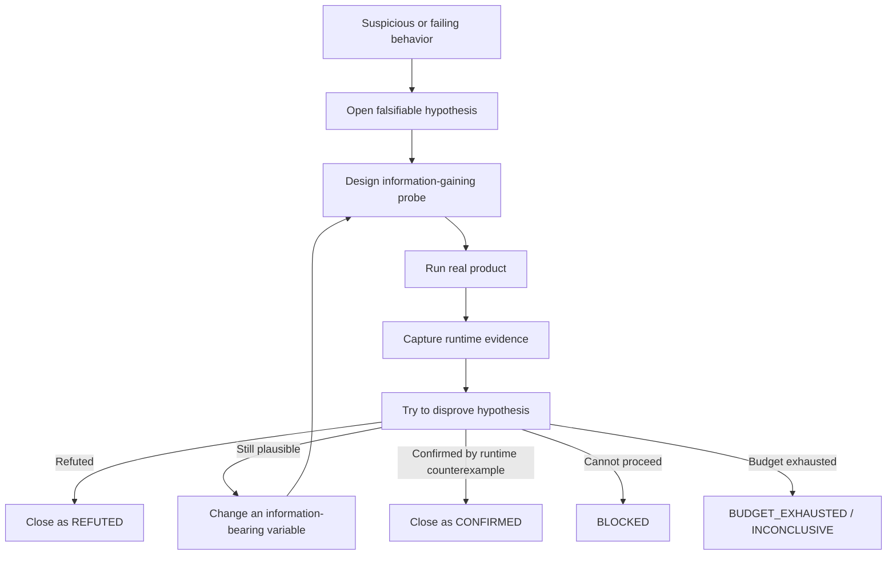
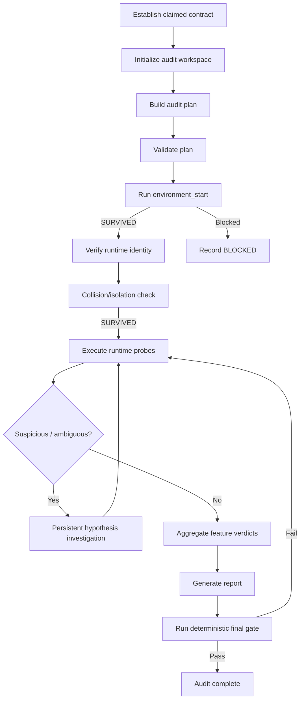

# Runtime Feature Falsifier

**Falsification-first runtime auditing for AI coding agents.**

Runtime Feature Falsifier (RFF) is an Agent Skill and companion CLI for checking whether software features actually behave as claimed **through the running product**, instead of trusting source presence, test-suite success, UI chrome, canned demo output, or superficial wiring.

It is designed to hunt for functionality that is:

- `TODO` / unimplemented,
- placeholder-only,
- fake or no-op,
- `BTTLP` (**be-there-to-look-pretty**) — present enough to look implemented without completing the advertised behavior,
- hardcoded to fixtures or narrow examples,
- mock-only,
- partially implemented,
- superficially wired,
- or otherwise broken inside the claimed runtime contract.

> **Core idea:** RFF does not try to prove that a feature is “alive.” It tries to **falsify the claim**. A feature that survives the declared probe matrix is reported as `NOT_FALSIFIED`, never as “proven,” “verified,” or “correct.”

Current release: **v2.8.0**

## At a glance

- **Audit target:** real runtime/product behavior, not test-suite appearance.
- **Modes:** bounded `FEATURE` audit or exhaustive `SYSTEM` audit.
- **Persistence:** bounded hypothesis-driven investigation; no blind retries.
- **Integrity:** hash-chained logs, locked readers/writers, source baseline, schema validation, stale-report detection, identity/collision preflight, sealed-run policy, deterministic completion gate.
- **Supported hosts:** Codex CLI, Google Antigravity 2.0, Google Antigravity CLI, Gemini CLI, OpenCode, and Claude Code.
- **Installer:** `./install.sh` for humans; `rff` for project integration management and automation.

## Contents

- [Why this exists](#why-this-exists)
- [Showcase: auditing `upload-image`](#showcase-auditing-upload-image)
- [Key properties](#key-properties)
- [Quick start](#quick-start)
- [`rff` CLI](#rff-cli)
- [Supported agents](#supported-agents)
- [Audit workflow](#audit-workflow)
- [Audit artifacts](#audit-artifacts)
- [Probe strategy](#probe-strategy)
- [SYSTEM audits](#system-audits)
- [Safety and scope](#safety-and-scope)
- [Repository layout](#repository-layout)
- [Self-test](#self-test)
- [Installing from a published Git repository](#installing-from-a-published-git-repository)
- [Recommended prompts](#recommended-prompts)
- [Design principles](#design-principles)
- [Known limitations](#known-limitations)
- [Contributing](#contributing)
- [License](#license)

---

## Why this exists

AI coding agents can produce software that looks finished while the real behavior is not there:

```text
button exists                  ≠ feature works
route exists                   ≠ feature works
function exists                ≠ feature works
test passes                    ≠ feature works
mock returns expected output   ≠ feature works
HTTP 200                       ≠ required side effect happened
```

RFF changes the agent’s objective from:

```text
“Does the code look implemented?”
```

to:

```text
“Can I find a reproducible runtime counterexample to the advertised behavior?”
```

The target implementation and target tests are treated as **read-only during the audit**. Persistence applies to the investigation, not to repairing the target.

---

## Showcase: auditing `upload-image`

A weak audit might do this:

```text
POST /upload image.png
→ 201 Created
→ PASS
```

RFF expects something closer to:

```text
1. Start the real application through its documented startup path.
2. Confirm startup health.
3. Upload a valid PNG through the real UI/API/CLI entry point.
4. Verify the downstream object actually exists.
5. Retrieve/render/download it through another real path.
6. Upload a materially different image and compare resulting state.
7. Exercise other supported image formats.
8. Exercise invalid/non-image inputs.
9. Exercise corrupt/truncated/mislabeled files.
10. Check duplicate/retry behavior.
11. Check persistence if persistence is part of the contract.
12. Investigate suspicious behavior until the hypothesis is resolved.
```

Example failure:

```text
PNG A → 201 → /files/demo-image.png
PNG B → 201 → /files/demo-image.png
PDF   → 201 → /files/demo-image.png

retrieved hash(A) == hash(B)
```

RFF can then investigate the hypothesis that the endpoint is returning canned output and, if runtime evidence confirms it, report:

```text
Runtime verdict:        FALSIFIED
Implementation pattern: HARDCODED
Confidence:             HIGH
```

---

## Key properties

### Runtime-first evidence

Primary evidence comes from the real supported product surface:

- browser/UI interaction,
- public HTTP/API surface,
- CLI command,
- public SDK/library interface,
- RPC/event/job trigger when that is the supported interface,
- and the required downstream state or side effect.

Reading source code is secondary. Source inspection is useful **after** runtime evidence exists, to classify why the behavior failed.

### Falsification-first verdicts

RFF uses four runtime verdicts:

| Verdict | Meaning |
| --- | --- |
| `FALSIFIED` | A reproducible counterexample violates a claimed obligation. |
| `NOT_FALSIFIED` | Required planned probes completed without a counterexample. This is not proof of correctness. |
| `BLOCKED` | A required dependency, credential, runtime surface, or environment is unavailable. |
| `INCONCLUSIVE` | Evidence is contradictory, ambiguous, or the bounded investigation budget was exhausted. |

Implementation-pattern labels are separate from runtime verdicts:

```text
TODO
PLACEHOLDER
FAKE_NOOP
BTTLP
HARDCODED
MOCK_ONLY
PARTIAL_IMPLEMENTATION
REAL_BUT_BROKEN
NONE_OBSERVED
UNKNOWN_PATTERN
```

### Persistent investigation

A suspicious result does not automatically become a finding.

RFF uses a bounded hypothesis loop:



Blind retries do not count as persistence. A retry must either change an information-bearing variable or explicitly explain why an unchanged repetition is useful for reproducibility/nondeterminism analysis.

### FEATURE and SYSTEM modes

RFF has two scopes:

- **`FEATURE`** — one named feature or an explicitly bounded set of capabilities.
- **`SYSTEM`** — all/every features, whole-project, whole-system, or equivalent exhaustive requests.

A `SYSTEM` audit is **not representative sampling**.

It must:

1. discover the runtime/product capability universe,
2. create `feature-inventory.json`,
3. map every `IN_SCOPE` capability into the audit plan,
4. include meaningful cross-feature workflows,
5. execute the required runtime probes,
6. and pass the deterministic final gate.

---

# Quick start

## Prerequisite

The bootstrap installer uses [`uv`](https://docs.astral.sh/uv/).

After cloning or extracting the repository:

```bash
./install.sh
```

The installer updates the persistent `rff` CLI and opens an interactive wizard.

Typical flow:

```text
Runtime Feature Falsifier v2.8.0

Detected agents
  [x] Codex CLI
  [x] Google Antigravity 2.0
  [x] Google Antigravity CLI
  [ ] Gemini CLI
  [x] OpenCode
  [x] Claude Code

Install for
  [1] All detected
  [2] Codex CLI
  [3] Google Antigravity 2.0
  [4] Google Antigravity CLI
  [5] Gemini CLI
  [6] OpenCode
  [7] Claude Code
  [8] All supported
  [0] Cancel
```

The installer asks for the target project, previews the managed destinations, and installs or updates the selected integrations.

### Non-interactive examples

Codex:

```bash
./install.sh \
  --codex \
  --project /path/to/project \
  --force
```

Google Antigravity 2.0:

```bash
./install.sh \
  --antigravity2 \
  --project /path/to/project \
  --force
```

Google Antigravity CLI:

```bash
./install.sh \
  --antigravity-cli \
  --project /path/to/project \
  --force
```

Legacy Google alias — installs the shared Antigravity workspace integration for both 2.0 and CLI:

```bash
./install.sh \
  --antigravity \
  --project /path/to/project \
  --force
```

Gemini CLI:

```bash
./install.sh \
  --gemini \
  --project /path/to/project \
  --force
```

OpenCode:

```bash
./install.sh \
  --opencode \
  --project /path/to/project \
  --force
```

Claude Code:

```bash
./install.sh \
  --claude \
  --project /path/to/project \
  --force
```

### Windows

`install.sh` is the POSIX bootstrap. The packaged Python CLI is cross-platform.

With the prebuilt wheel:

```powershell
uv tool install .\dist\runtime_feature_falsifier_cli-2.7.0-py3-none-any.whl --force
rff init
```

RFF documentation uses `python3` for POSIX examples. On default Windows Python installations, use `py -3` instead.

---

# `rff` CLI

After installation, use the persistent CLI from any project:

```bash
rff --version
rff integration list
rff detect --here
rff doctor --here
rff init --here
```

Install a specific integration:

```bash
rff init --here --integration codex
rff init --here --integration antigravity2
rff init --here --integration antigravity-cli
rff init --here --integration gemini
rff init --here --integration opencode
rff init --here --integration claude
```

Multiple integrations:

```bash
rff init --here \
  --integration codex \
  --integration opencode \
  --integration antigravity-cli
```

All supported integrations:

```bash
rff init --here --integration all
```

Automation/CI:

```bash
rff init /path/to/project \
  --integration codex \
  --non-interactive \
  --yes \
  --force
```

CLI self-management:

```bash
rff self version
rff self check
rff self upgrade --from /path/to/new/release
```

---

# Supported agents

RFF is designed as a portable Agent Skill with host-specific companions where the host supports them.

| Agent / host | Integration key | Project skill path | Dedicated auditor | SYSTEM planning guidance |
| --- | --- | --- | --- | --- |
| **Codex CLI** | `codex` | `.agents/skills/runtime-feature-falsifier/` | Portable skill | Prefer `/plan` before exhaustive execution |
| **Google Antigravity 2.0** | `antigravity2` | `.agents/skills/runtime-feature-falsifier/` | `.agents/agents/runtime-feature-auditor/agent.md` | Use Planning Mode / Implementation Plan |
| **Google Antigravity CLI** | `antigravity-cli` | `.agents/skills/runtime-feature-falsifier/` | `.agents/agents/runtime-feature-auditor/agent.md` | Use CLI plan mode before execution |
| **Gemini CLI** | `gemini` | `.agents/skills/runtime-feature-falsifier/` | Portable skill | Use the host planning mechanism before SYSTEM execution |
| **OpenCode** | `opencode` | `.opencode/skills/runtime-feature-falsifier/` | `.opencode/agents/runtime-feature-auditor.md` | Use a plan-oriented workflow for SYSTEM discovery |
| **Claude Code** | `claude` | `.claude/skills/runtime-feature-falsifier/` | `.claude/agents/runtime-feature-auditor.md` + hooks | Plan first for non-trivial SYSTEM audits |

## Codex CLI

Installed at:

```text
<project>/.agents/skills/runtime-feature-falsifier/
```

Typical FEATURE request:

```text
Use $runtime-feature-falsifier to audit the upload-image feature.
Do not modify implementation or tests.
Try to falsify the claimed behavior through the real runtime surface.
```

For a whole-project audit, start with:

```text
/plan
```

Then ask Codex to discover the full capability universe and produce the SYSTEM audit strategy before leaving Plan Mode and executing runtime probes.

## Google Antigravity 2.0

Workspace installation:

```text
<project>/.agents/skills/runtime-feature-falsifier/
<project>/.agents/agents/runtime-feature-auditor/agent.md
```

Use either the skill directly or select the dedicated `runtime-feature-auditor` custom agent.

For SYSTEM audits, use Antigravity Planning Mode / an Implementation Plan artifact before runtime execution.

Optional strict workspace hooks can be installed with:

```bash
rff init --here \
  --integration antigravity2 \
  --strict-google-hooks \
  --force
```

Strict Google hooks are opt-in because `.agents/hooks.json` affects the whole workspace, not only an RFF audit.

## Google Antigravity CLI

The CLI executable is `agy`.

RFF uses the same shared workspace skill and custom-agent locations as Antigravity 2.0:

```text
<project>/.agents/skills/runtime-feature-falsifier/
<project>/.agents/agents/runtime-feature-auditor/agent.md
```

After installation:

```bash
cd /path/to/project
agy
```

Then check:

```text
/skills
/agents
```

You should see:

```text
runtime-feature-falsifier
runtime-feature-auditor
```

For SYSTEM audits, use Antigravity CLI plan mode before starting runtime probes.

## Gemini CLI

Installed project-locally at:

```text
<project>/.agents/skills/runtime-feature-falsifier/
```

The portable skill contains the complete audit methodology and deterministic controller. Start a fresh Gemini CLI session after installing/updating if skill discovery appears stale.

## OpenCode

RFF intentionally uses OpenCode’s native project path rather than relying on `.agents/skills` compatibility:

```text
<project>/.opencode/
├── skills/
│   └── runtime-feature-falsifier/
└── agents/
    └── runtime-feature-auditor.md
```

The dedicated auditor denies OpenCode’s direct `edit` action, explicitly permits the RFF skill, and retains shell access for real runtime startup and probing.

Select `runtime-feature-auditor`, or instruct the normal agent to load the exact skill ID:

```text
runtime-feature-falsifier
```

Restart OpenCode or begin a fresh session after installation/update so discovery refreshes.

## Claude Code

Installed at:

```text
<project>/.claude/
├── skills/
│   └── runtime-feature-falsifier/
├── agents/
│   └── runtime-feature-auditor.md
└── runtime-feature-falsifier-hooks/
```

The dedicated Claude auditor preloads the skill and uses lifecycle hooks for additional enforcement, including final-gate behavior.

---

# Audit workflow

RFF’s normative protocol lives in [`runtime-feature-falsifier/SKILL.md`](runtime-feature-falsifier/SKILL.md).

The high-level sequence is:



## 1. Establish the claimed contract

Before judging behavior, determine what the product actually promises.

Priority:

1. explicit user requirements / acceptance criteria,
2. product or API documentation,
3. UI copy / CLI help / public schema,
4. implementation-facing docs/configuration,
5. existing tests only as last-resort claim discovery.

Tests may help discover claims, but **test success is not runtime proof**.

## 2. Initialize the audit

Audit artifacts live under:

```text
<project>/.runtime-feature-audit/
```

Typical initialization:

```bash
python3 scripts/auditctl.py init \
  --audit-dir "<project-root>/.runtime-feature-audit" \
  --target-root "<project-root>" \
  --project-name "<project>" \
  --environment "local" \
  --scope "<requested scope>" \
  --mode feature
```

For a SYSTEM audit:

```bash
python3 scripts/auditctl.py init \
  --audit-dir "<project-root>/.runtime-feature-audit" \
  --target-root "<project-root>" \
  --project-name "<project>" \
  --environment "local" \
  --scope "whole project" \
  --mode system
```

## 3. Build and validate the plan

RFF requires a real documented startup procedure and an `environment_start` probe.

The plan describes:

- feature IDs,
- claimed contracts,
- real entry points,
- expected effects,
- dependencies,
- whether the feature is input-sensitive,
- whether it is stateful,
- whether it is dependency-sensitive,
- and the required falsification probes.

Validate before execution:

```bash
python3 scripts/auditctl.py validate-plan \
  --audit-dir "<project-root>/.runtime-feature-audit"
```

## 4. Run the three-stage preflight

Regular feature probes are rejected until all three preflight probes have completed in order:

1. `environment_start` — must complete as `SURVIVED`,
2. `runtime_identity` — verify the actual process/server/container is running the intended app against the declared `runtime_identity_expectation`. A healthy container or `/healthz` response alone is not identity proof,
3. `environment_collision` — must complete as `SURVIVED`; shared queues, DB schemas, buckets, ports, or tenants that could collide with tests or live workers must be isolated or recorded.

All preflight and dependency-sensitive attempts require reproduction metadata.

This does not cryptographically prove the agent used the intended public surface. Where that distinction matters, prefer stronger transport/runtime evidence such as:

- browser traces,
- HTTP request/response capture,
- HAR/network evidence,
- CLI command output,
- retrieved downstream artifacts,
- persistence/state inspection.

## 5. Log probes before and after execution

Single probe:

```bash
python3 scripts/auditctl.py attempt-start \
  --audit-dir "<project-root>/.runtime-feature-audit" \
  --feature-id upload-image \
  --probe-id valid-png \
  --action "Upload valid PNG through the real upload surface" \
  --repro-command "<command-if-applicable>"
```

Run the **real runtime action**, capture evidence, then finish it:

```bash
python3 scripts/auditctl.py attempt-finish \
  --audit-dir "<project-root>/.runtime-feature-audit" \
  --attempt-id <attempt-id> \
  --observed "<what actually happened>" \
  --side-effect-check "<downstream observation>" \
  --evidence <relative-evidence-path> \
  --result <SURVIVED|FALSIFIED|BLOCKED|INCONCLUSIVE> \
  --failure-pattern <pattern> \
  --confidence <HIGH|MEDIUM|LOW>
```

## 6. Batch logging for large audits

Large SYSTEM audits can pre-register multiple attempts in one hash-chained operation:

```bash
python3 scripts/auditctl.py attempt-batch \
  --audit-dir "<project-root>/.runtime-feature-audit" \
  --input starts.json
```

Execute those already-registered probes, then ingest the results:

```bash
python3 scripts/auditctl.py attempt-batch \
  --audit-dir "<project-root>/.runtime-feature-audit" \
  --input finishes.json
```

Batching reduces logging ceremony. It does **not** permit fabricated observations.

## 7. Investigate ambiguity persistently

Open a bounded hypothesis:

```bash
python3 scripts/auditctl.py hypothesis-open \
  --audit-dir "<project-root>/.runtime-feature-audit" \
  --feature-id upload-image \
  --statement "Uploader ignores input and returns canned output" \
  --trigger-attempt-id <attempt-id> \
  --next-probe "Upload distinct image and compare read-back" \
  --max-attempts 6
```

Terminal hypothesis states are:

```text
REFUTED
CONFIRMED
BLOCKED
BUDGET_EXHAUSTED
```

The final gate rejects unresolved `OPEN` or `SUPPORTED` hypotheses.

## 8. Generate the report and pass the gate

```bash
python3 scripts/auditctl.py report \
  --audit-dir "<project-root>/.runtime-feature-audit"
```

Then:

```bash
python3 scripts/auditctl.py gate \
  --audit-dir "<project-root>/.runtime-feature-audit" \
  --require-report
```

**The audit is not complete until the gate exits `0`.**

A successful completion gate means the audit protocol is internally complete and consistent. It does **not** mean all audited features are healthy.

A passed gate **seals the run**. After remediation, spawn a fresh auditor and initialize a new workspace (for example `.runtime-feature-audit-run2/`) rather than appending to the sealed run.

---

# Audit artifacts

A typical audit workspace contains:

```text
.runtime-feature-audit/
├── audit-plan.json
├── feature-inventory.json        # SYSTEM mode
├── attempts.jsonl
├── hypothesis-ledger.jsonl
├── evidence/
├── tracked-source-baseline.json
├── feature-matrix.md
├── system-coverage.md            # SYSTEM mode
├── audit-report.md
├── .active.json
├── .report-state.json
└── .complete.json
```

### Integrity model

RFF provides several layers of integrity checking:

- STARTED/FINISHED two-phase attempt logging,
- append-only hash-chained attempt history,
- append-only hash-chained hypothesis history,
- current chain-head hashes printed by controller responses,
- cross-platform file locking for readers and writers,
- JSON Schema Draft 7 structural validation,
- semantic audit-plan validation,
- Git-tracked source baseline comparison,
- report freshness fingerprints,
- three-stage preflight enforcement (startup health, runtime identity, environment collision),
- sealed-run policy preventing workspace reuse after remediation,
- terminology guard for retrospectives (`auditctl terminology-check`),
- deterministic final completion gate.

RFF is **tamper-evident, not tamper-proof**. An agent with unrestricted filesystem/shell privileges is not cryptographically sandboxed by this skill.

---

# Probe strategy

RFF favors probes that expose superficial implementations.

Common probe intents include:

```text
baseline_valid
valid_variation
causal_sensitivity
invalid_type_or_shape
boundary
state_transition
round_trip
persistence
repeat_or_duplicate
dependency_authenticity
workflow_completion
```

Useful differential/metamorphic patterns:

- upload two different files and compare resulting state,
- create two records with different values and read both back,
- change a search query and confirm results respond causally,
- change authenticated identity and confirm authorization/state follows it,
- restart the application when persistence is claimed,
- run the full advertised workflow rather than validating only the first response.

---

# Example input matrix for image upload

RFF does **not** assume every image format is supported. It first derives the contract, then classifies inputs as valid, invalid, boundary, or contract-unknown.

A representative investigation can include:

### Claimed/possible image family

```text
JPEG / JPG
PNG
GIF
WebP
TIFF / TIF
SVG
EPS
```

### Structural variations

```text
tiny image
normal image
large image
wide/tall aspect ratios
transparency
animation
metadata
Unicode filenames
spaces in filenames
mixed-case extensions
```

### Content/metadata mismatch

```text
correct extension + correct MIME
wrong extension
wrong MIME
text renamed to .png
missing content type
truncated file
empty file
```

### Non-image families

```text
TXT
JSON
source code
PDF
DOCX
PPTX
ZIP
```

The expected result depends on the documented product contract. Correctly rejecting an unsupported TIFF, for example, is not a defect merely because TIFF exists as an image format.

---

# SYSTEM audits

A whole-project request is binding.

If the user asks:

```text
Audit every feature in this system.
```

RFF must not silently turn it into:

```text
I tested login, upload, and search as representative features.
```

Instead it builds a feature universe using multiple discovery surfaces such as:

- user/product documentation,
- UI routes/navigation,
- API routes/schema,
- CLI commands,
- public SDK exports,
- jobs/events/webhooks,
- feature registrations,
- relevant implementation-facing discovery.

Each discovered item is reconciled as either:

```text
IN_SCOPE
EXCLUDED with a legitimate documented reason
```

Unavailable dependencies do not make a feature “excluded.” They produce `BLOCKED` attempts.

Meaningful cross-feature workflows should also be represented, for example:

```text
register
→ login
→ upload
→ search
→ open
→ delete
→ confirm deletion
```

---

# Safety and scope

RFF is a runtime feature auditor, not an authorization bypass or destructive testing framework.

Default boundaries:

- prefer local or explicitly authorized staging environments,
- do not probe production unless the user explicitly authorizes it,
- do not perform destructive, denial-of-service, exploit, credential, or production-impacting probes unless separately scoped and authorized,
- do not modify target source/tests/configuration to make behavior pass,
- runtime state naturally produced by using the application is allowed,
- if a real dependency cannot be exercised, report `BLOCKED` rather than substituting a mock.

RFF is not a replacement for:

- unit tests,
- integration tests,
- E2E suites,
- security penetration testing,
- load testing,
- formal verification.

It answers a different question:

> **Does the claimed product behavior survive direct runtime falsification attempts?**

---

# Repository layout

```text
runtime-feature-falsifier/
├── CHANGELOG.md
├── INTEGRATION-NOTES.md
├── VERSION
├── install.sh
├── installer.py
├── pyproject.toml
├── self-test.sh
├── dist/
│   └── runtime_feature_falsifier_cli-<version>-py3-none-any.whl
├── runtime-feature-falsifier/
│   ├── SKILL.md
│   ├── VERSION
│   ├── LICENSE
│   ├── agents/
│   │   └── openai.yaml
│   ├── assets/
│   ├── references/
│   ├── scripts/
│   │   └── auditctl.py
│   └── vendor/
├── claude-code/
├── google-antigravity/
├── opencode/
├── src/runtime_feature_falsifier_cli/
└── tests/
    ├── evals/
    ├── teaching-corpus/
    └── tools/
```

`runtime-feature-falsifier/SKILL.md` is the **normative source of audit semantics**. Reference files may elaborate host-specific procedures and examples but must not redefine verdicts, retry rules, hard invariants, or completion conditions.

---

# Self-test

Run the distribution self-test before publishing or after modifying the skill:

```bash
./self-test.sh
```

The repository includes intentionally broken teaching fixtures for patterns such as:

```text
FAKE_NOOP
TODO
HARDCODED
MOCK_ONLY
BTTLP
```

It also includes regressions for:

- varied runtime input matrices,
- SYSTEM anti-sampling,
- persistent investigation,
- startup/identity/collision preflight and reproduction requirements,
- batch logging,
- concurrent writers,
- locked readers,
- JSON Schema validation,
- reporting terminology and sealed workspaces,
- installer/update layouts,
- and supported-agent packaging.

The teaching fixtures are for validating **RFF itself**. They are not permission to use a target project’s test suite as proof of feature behavior.

---

# Installing from a published Git repository

Once you publish the project, the CLI package is structured for a Spec-Kit-style installation flow.

Example:

```bash
uv tool install runtime-feature-falsifier-cli \
  --from git+https://github.com/<owner>/<repo>.git@v2.8.0
```

Then:

```bash
rff init --here
```

Or directly:

```bash
rff init --here --integration codex
```

Upgrade from a specific release/source:

```bash
rff self upgrade \
  --from git+https://github.com/<owner>/<repo>.git@v2.8.0
```

Automatic “latest release” discovery is intentionally not claimed until the repository has a canonical public release channel.

---

# Recommended prompts

## One feature

```text
Use runtime-feature-falsifier to audit the upload-image feature.

Do not modify implementation or tests.
Determine the claimed contract first, start the application through its real
supported startup path, and attempt to falsify the feature through the real
runtime entry point.

Use valid variations, invalid inputs, boundaries, causal/differential probes,
state-transition checks, round-trip retrieval, persistence, and dependency
authenticity where applicable.

Persist on ambiguous or intermittent behavior using bounded hypotheses and
information-gaining retries. Finish only when the deterministic audit gate
passes.
```

## Whole project

```text
Use runtime-feature-falsifier in SYSTEM mode to audit this entire project.

Do not use representative sampling. First perform read-only discovery and
build the complete runtime/product feature inventory. Map every in-scope
capability and meaningful cross-feature workflow into the audit plan.

Do not modify implementation or tests. Run the real application, exercise the
real public runtime surfaces, preserve every attempt and blocker, investigate
ambiguous failures persistently, and finish only when the SYSTEM completion
gate passes.
```

---

# Design principles

RFF is built around a few deliberately strict ideas:

1. **Runtime behavior beats source appearance.**
2. **A success response is not the same as the advertised effect.**
3. **Tests are evidence about tests, not proof of runtime reality.**
4. **The auditor must not repair the target while auditing it.**
5. **Persistence belongs to investigation, not to forcing a green result.**
6. **A failure hypothesis should be challenged, not merely confirmed.**
7. **Large audits need machine-checkable inventory and coverage, not memory.**
8. **Logging must be cheap enough that agents have little incentive to fake it.**
9. **Completion is a deterministic gate, not a feeling.**
10. **`NOT_FALSIFIED` is scoped evidence, not proof of correctness.**

---

# Known limitations

- RFF is not a complete sandbox. An agent with unrestricted shell/filesystem privileges can still attempt mutation; tracked-source baselines, host permissions, hooks, and final gates are defense-in-depth.
- Hash chaining is tamper-evident, not cryptographically tamper-proof against an actor that controls the entire workspace. Controller chain heads are emitted to the session transcript to strengthen external evidence.
- A reproduction command, startup probe, and runtime-identity check do not mathematically prove that an agent used the intended public surface or the intended build. Capture browser/network/CLI transport evidence when that distinction matters.
- Exhaustive SYSTEM audits can be expensive. Batch logging reduces controller ceremony, but real feature coverage still requires real execution.
- Feature discovery can be incomplete when product surfaces or credentials are unavailable. Report this explicitly rather than claiming complete coverage.

---

# Contributing

Changes to the audit protocol should preserve these boundaries:

- `SKILL.md` remains normative,
- target code/tests stay read-only during audits,
- runtime evidence remains primary,
- `NOT_FALSIFIED` must never become “verified,”
- SYSTEM mode must not silently sample,
- controller state must remain schema-validated and integrity-checked,
- host-specific integrations must not weaken the portable core.

Before opening a pull request, run:

```bash
./self-test.sh
```

When changing an integration, also verify its install/update path using the relevant `rff init --integration ...` command.

---

# License

Runtime Feature Falsifier is distributed under the **MIT License**. See [`runtime-feature-falsifier/LICENSE`](runtime-feature-falsifier/LICENSE).

The bundled `fastjsonschema` dependency retains its upstream BSD license and attribution under `runtime-feature-falsifier/licenses/`.
