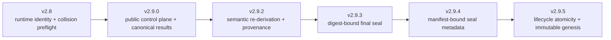
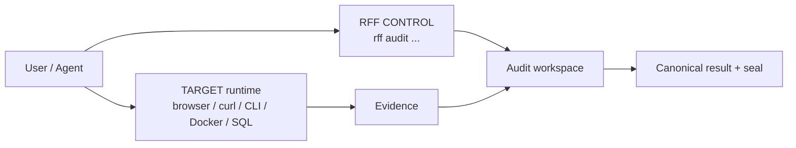
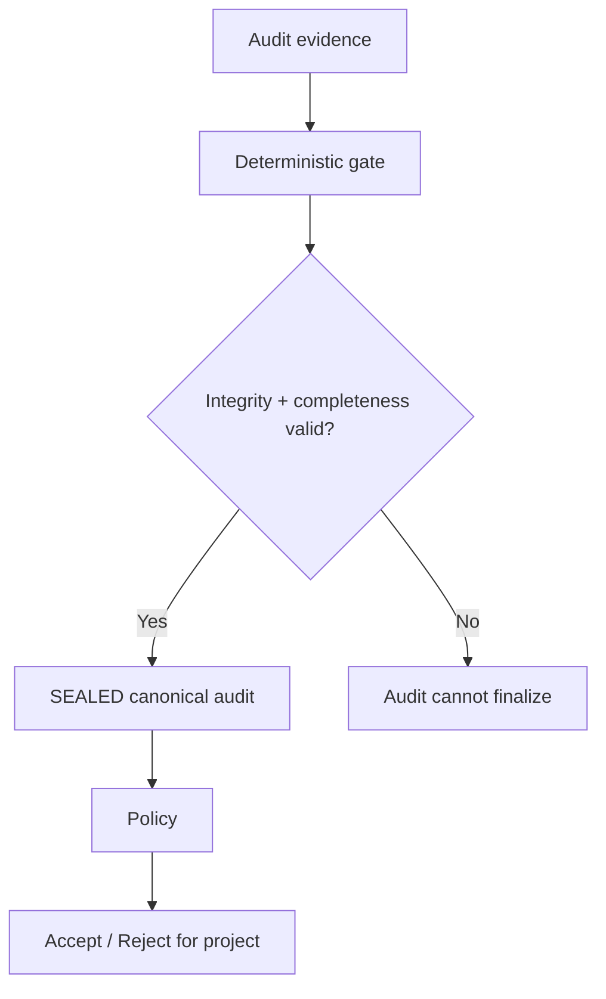
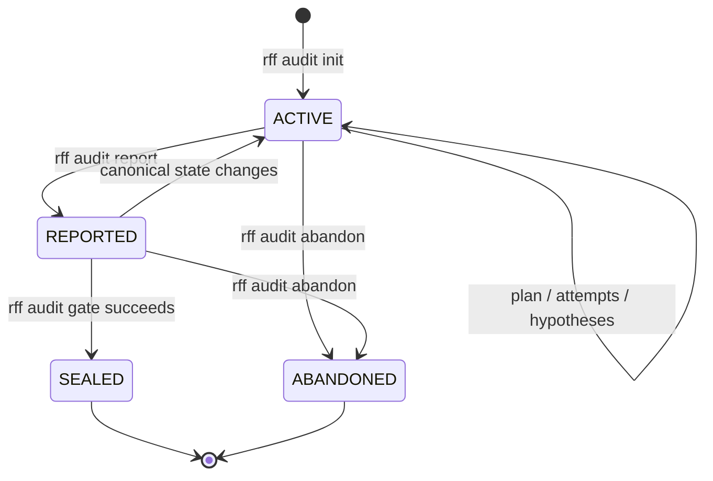
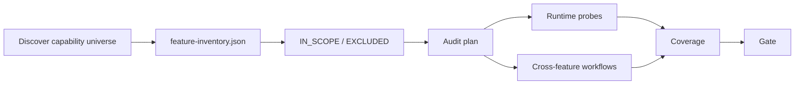
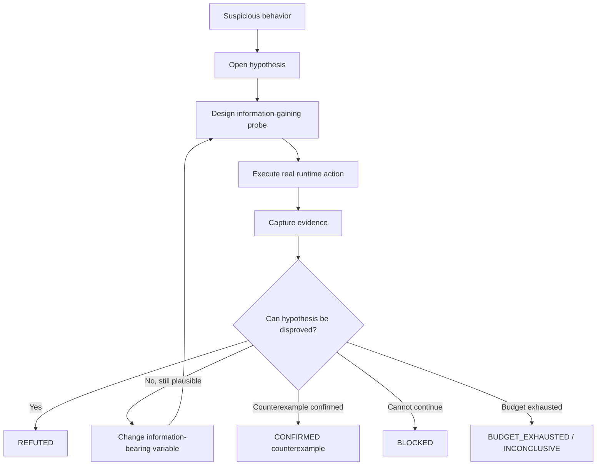
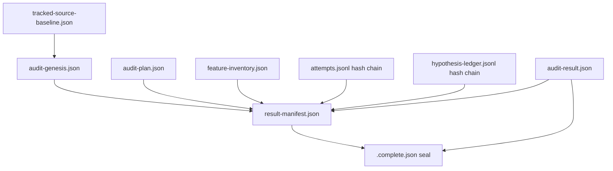

# Runtime Feature Falsifier

<div align="center">

**Falsification-first runtime auditing for AI coding agents.**

[](https://github.com/saltless-bruh/runtime-feature-falsifier)
[](https://www.python.org/)
[](runtime-feature-falsifier/LICENSE)
[](#integrity-and-trust-model)
[](#verdict-semantics)

</div>

Runtime Feature Falsifier (**RFF**) is an Agent Skill and companion CLI for checking whether software features actually behave as claimed **through the running product**.

RFF does not trust source presence, passing tests, UI chrome, HTTP 200 responses, mocks, or demo output as proof that a feature works. It starts from the opposite question:

> **Can the advertised runtime claim be falsified with a reproducible counterexample?**

A feature that survives the declared probe matrix is reported as `NOT_FALSIFIED` — never “verified,” “proven,” or “correct.”

**Current release: `v2.9.5`**

---

## At a glance

| | |
| --- | --- |
| **Primary target** | Real runtime/product behavior |
| **Audit modes** | `FEATURE` and exhaustive `SYSTEM` |
| **Control plane** | `rff audit ...` |
| **Canonical result** | `audit-result.json` |
| **Finalization** | Digest-bound, seal-last gate |
| **Lifecycle** | Active runs are mutable; sealed runs are immutable |
| **Integrity** | Genesis + source baseline + hash-chained ledgers + JCS manifest + seal |
| **History** | UUIDv7 runs, `latest.json`, canonical compare |
| **Acceptance policy** | Separate from audit validity |
| **Interop** | Markdown / JSON / SARIF |
| **Runtime dependencies** | Self-contained/offline-capable validator |
| **Python** | `>= 3.11` |
| **Agents** | Codex CLI, Antigravity 2.0, Antigravity CLI, Gemini CLI, OpenCode, Claude Code |

---

## Contents

- [Why RFF exists](#why-rff-exists)
- [What changed in v2.9](#what-changed-in-v29)
- [The RFF model](#the-rff-model)
- [Verdict semantics](#verdict-semantics)
- [Gate vs policy](#gate-vs-policy)
- [Quick start](#quick-start)
- [The `rff` CLI](#the-rff-cli)
- [Audit lifecycle](#audit-lifecycle)
- [FEATURE and SYSTEM modes](#feature-and-system-modes)
- [Probe strategy](#probe-strategy)
- [Persistent investigation](#persistent-investigation)
- [Integrity and trust model](#integrity-and-trust-model)
- [Audit artifacts](#audit-artifacts)
- [History, compare, policy, and SARIF](#history-compare-policy-and-sarif)
- [Supported agents](#supported-agents)
- [Output configuration](#output-configuration)
- [Safety and scope](#safety-and-scope)
- [Repository layout](#repository-layout)
- [Self-test and release validation](#self-test-and-release-validation)
- [Recommended prompts](#recommended-prompts)
- [Design principles](#design-principles)
- [Known limitations](#known-limitations)
- [Roadmap](#roadmap)
- [Contributing](#contributing)
- [License](#license)

---

# Why RFF exists

AI coding agents can produce software that looks finished while the runtime behavior is incomplete, superficial, or fake.

```text
button exists                  ≠ feature works
route exists                   ≠ feature works
function exists                ≠ feature works
test passes                    ≠ feature works
mock returns expected output   ≠ feature works
HTTP 200                       ≠ required side effect happened
```

RFF is designed to expose patterns such as:

- `TODO` / unimplemented paths,
- placeholder-only behavior,
- fake or no-op implementations,
- `BTTLP` (**be-there-to-look-pretty**) behavior,
- hardcoded fixture responses,
- mock-only behavior,
- partial implementations,
- superficially wired paths,
- dependency substitutions,
- runtime identity mistakes,
- environment interference,
- stale or non-causal output,
- and other violations of the claimed runtime contract.

The auditor changes its objective from:

```text
"Does the implementation look finished?"
```

to:

```text
"Can I produce a reproducible runtime counterexample?"
```

Target implementation and target tests remain **read-only during the audit**. Persistence applies to the investigation, not to repairing the target.

---

# What changed in v2.9

v2.8 hardened the runtime preflight. v2.9 turns RFF into a much stronger **audit control plane**.



### Major v2.9 capabilities

**Public control plane**

```bash
rff audit ...
```

Direct `auditctl.py` use remains an internal/compatibility path.

**Multi-run project-local history**

```text
<output-root>/
├── active.json
├── latest.json
└── runs/
    ├── rff-<uuidv7>/
    ├── rff-<uuidv7>/
    └── ...
```

**Canonical machine-readable outputs**

- `audit-result.json`
- `findings.json`
- `result-manifest.json`
- `audit-summary.md`

**Canonical integrity**

- strict JSON ingestion,
- float-free RFC 8785/JCS hashing profile,
- schema validation,
- semantic re-derivation,
- plan/inventory/ledger provenance,
- digest-bound final seal.

**Immutable audit genesis**

`audit-genesis.json` binds the original tracked-source baseline so the auditor cannot simply refresh the baseline after changing source.

**Lifecycle enforcement**

- active + unsealed → mutation allowed,
- sealed → immutable history,
- one audit-wide control lock serializes stateful read/check/write operations.

**Validated readers**

`present`, `policy`, `export`, and `compare` reject invalid, unsealed, tampered, or incompatible canonical inputs.

**Historical migration**

v2.9.5 can recognize historical v2.9.0–v2.9.4 sealed states as migration inputs and revalidate them before upgrading to the current seal protocol.

---

# The RFF model

RFF separates three kinds of action:



### CONTROL

Commands that manage canonical RFF state.

Examples:

```text
rff audit init
rff audit attempt start
rff audit attempt finish
rff audit report
rff audit gate
rff audit policy
rff audit compare
```

### TARGET

Actions against the product being audited.

Examples:

```text
browser interaction
curl
docker compose
application CLI
SQL
public SDK call
RPC/event/job trigger
```

RFF records what happened. It does **not** replace the real runtime action.

### ILLUSTRATION

Documentation examples only. They are not automatically executable audit steps.

---

# Verdict semantics

RFF uses four runtime verdicts.

| Verdict | Meaning |
| --- | --- |
| `FALSIFIED` | A reproducible counterexample violates a claimed obligation. |
| `NOT_FALSIFIED` | Required planned probes completed without a qualifying counterexample. **Not proof of correctness.** |
| `BLOCKED` | A required dependency, credential, runtime surface, permission, or environment is unavailable. |
| `INCONCLUSIVE` | Evidence remains ambiguous/contradictory, or the bounded investigation budget was exhausted. |

Implementation-pattern classification is separate from the runtime verdict:

```text
TODO
PLACEHOLDER
FAKE_NOOP
BTTLP
HARDCODED
MOCK_ONLY
PARTIAL_IMPLEMENTATION
REAL_BUT_BROKEN
NONE_OBSERVED
UNKNOWN_PATTERN
```

Severity and confidence are separate dimensions as well.

---

# Gate vs policy

This distinction is central in v2.9.



A successful gate means:

> **The audit record is structurally valid, complete enough for its declared plan, internally consistent, and sealed.**

It does **not** mean:

> “The product is healthy.”

A perfectly valid sealed audit may contain several `FALSIFIED` features.

Example acceptance policy:

```bash
rff audit policy --fail-on FALSIFIED
```

or:

```bash
rff audit policy \
  --fail-on FALSIFIED \
  --fail-on BLOCKED \
  --fail-on SEVERITY_CRITICAL \
  --fail-on SEVERITY_HIGH
```

---

# Quick start

## Requirements

- Python **3.11+**
- [`uv`](https://docs.astral.sh/uv/) for bootstrap/install

Clone or extract the release bundle, then run:

```bash
./install.sh
```

The installer:

1. installs/updates the persistent `rff` CLI,
2. detects supported coding-agent clients,
3. shows the install/update plan,
4. installs selected project integrations.

Typical flow:

```text
Runtime Feature Falsifier v2.9.5

Detected agents
  [x] Codex CLI
  [x] Google Antigravity 2.0
  [x] Google Antigravity CLI
  [ ] Gemini CLI
  [x] OpenCode
  [x] Claude Code

Install for
  [1] All detected
  [2] Codex CLI
  [3] Google Antigravity 2.0
  [4] Google Antigravity CLI
  [5] Gemini CLI
  [6] OpenCode
  [7] Claude Code
  [8] All supported
  [0] Cancel
```

## Non-interactive examples

Codex:

```bash
./install.sh \
  --codex \
  --project /path/to/project \
  --force
```

OpenCode:

```bash
./install.sh \
  --opencode \
  --project /path/to/project \
  --force
```

Claude Code:

```bash
./install.sh \
  --claude \
  --project /path/to/project \
  --force
```

Antigravity 2.0:

```bash
./install.sh \
  --antigravity2 \
  --project /path/to/project \
  --force
```

Antigravity CLI:

```bash
./install.sh \
  --antigravity-cli \
  --project /path/to/project \
  --force
```

Gemini CLI:

```bash
./install.sh \
  --gemini \
  --project /path/to/project \
  --force
```

## Prebuilt wheel

The one-shot bundle contains a universal wheel:

```text
dist/runtime_feature_falsifier_cli-2.9.5-py3-none-any.whl
```

Install directly:

```bash
uv tool install ./dist/runtime_feature_falsifier_cli-2.9.5-py3-none-any.whl --force
```

Windows PowerShell:

```powershell
uv tool install .\dist\runtime_feature_falsifier_cli-2.9.5-py3-none-any.whl --force
rff --version
```

RFF docs use `python3` in POSIX examples. On a default Windows Python installation, `py -3` is typically the equivalent.

---

# The `rff` CLI

## Installation / integration management

```bash
rff --version
rff integration list
rff detect --here
rff doctor --here
rff init --here
```

Install one integration:

```bash
rff init --here --integration codex
rff init --here --integration antigravity2
rff init --here --integration antigravity-cli
rff init --here --integration gemini
rff init --here --integration opencode
rff init --here --integration claude
```

Install several:

```bash
rff init --here \
  --integration codex \
  --integration opencode \
  --integration claude
```

Install all supported integrations:

```bash
rff init --here --integration all
```

Automation:

```bash
rff init /path/to/project \
  --integration codex \
  --non-interactive \
  --yes \
  --force
```

## CLI self-management

```bash
rff self version
rff self check
rff self upgrade --from /path/to/new/release
```

## Audit control plane

```text
rff audit init [options]
rff audit where [--format json|text]
rff audit status [--format json|text]
rff audit plan validate
rff audit attempt start ...
rff audit attempt finish ...
rff audit attempt batch ...
rff audit hypothesis open ...
rff audit hypothesis update ...
rff audit investigation status
rff audit report
rff audit gate
rff audit policy --fail-on FALSIFIED
rff audit present --presentation chat|markdown|json
rff audit compare --baseline ... --current ...
rff audit export --export-format sarif
rff audit abandon --reason ...
```

---

# Audit lifecycle



### Important lifecycle rule

> **A sealed run is immutable history.**

After remediation or a re-audit:

```text
do not reopen the sealed run
→ initialize a new run
```

v2.9.5 enforces this in the controller. It is not merely agent guidance.

## Example audit initialization

Feature audit:

```bash
rff audit init \
  --project-name my-project \
  --environment local \
  --scope "upload-image" \
  --mode feature
```

System audit:

```bash
rff audit init \
  --project-name my-project \
  --environment local \
  --scope "whole project" \
  --mode system
```

Then discover the run location:

```bash
rff audit where --format json
```

Validate the completed plan before feature execution:

```bash
rff audit plan validate
```

---

# FEATURE and SYSTEM modes

## `FEATURE`

Use for:

- one feature,
- one capability,
- an explicitly bounded set of behaviors.

Example:

```text
Audit the upload-image feature.
```

## `SYSTEM`

Use for requests such as:

```text
Audit every feature.
Audit the entire project.
Audit the whole system.
```

SYSTEM is **not representative sampling**.

A SYSTEM audit must:

1. discover the runtime/product capability universe,
2. create `feature-inventory.json`,
3. classify every discovered capability,
4. map every `IN_SCOPE` item into the audit plan,
5. include meaningful cross-feature workflows,
6. execute required runtime probes,
7. account for blockers,
8. pass the deterministic final gate.



Unavailable dependencies are not a valid reason to silently exclude a feature. They produce `BLOCKED` evidence.

---

# Probe strategy

RFF favors probes that reveal superficial implementations.

Common probe intents:

```text
baseline_valid
valid_variation
causal_sensitivity
invalid_type_or_shape
boundary
state_transition
round_trip
persistence
repeat_or_duplicate
dependency_authenticity
workflow_completion
```

Useful differential/metamorphic patterns include:

- upload two materially different files and compare resulting state,
- create two records with different values and read both back,
- vary the query and confirm results respond causally,
- change authenticated identity and verify authorization/state follows it,
- restart when persistence is part of the contract,
- validate downstream side effects instead of stopping at the first success response,
- run the whole advertised workflow rather than one endpoint in isolation.

### Example: weak vs falsification-first

Weak:

```text
POST /upload image.png
→ 201 Created
→ PASS
```

Better:

```text
PNG A → 201 → /files/demo-image.png
PNG B → 201 → /files/demo-image.png
PDF   → 201 → /files/demo-image.png

retrieved hash(A) == hash(B)
```

That supports investigation of a potential `HARDCODED`, `FAKE_NOOP`, or `BTTLP` implementation.

---

# Persistent investigation

Suspicious behavior does not automatically become a finding.

RFF uses bounded falsifiable hypotheses:



Blind retries do not count as persistence.

A repeated probe must either:

- change an information-bearing variable, or
- document why an unchanged repetition is useful for nondeterminism/reproducibility analysis.

---

# Integrity and trust model

v2.9.5 uses multiple independent integrity layers.



## 1. Strict canonical input handling

Canonical security-sensitive JSON rejects:

- duplicate object keys,
- `NaN`,
- `Infinity`,
- unsafe canonical integer values,
- floats in the canonical v1 result profile,
- invalid Unicode scalar values.

## 2. Full schema validation

RFF ships its validator with the skill and resolves bundled schemas locally.

The runtime remains offline-capable.

## 3. Semantic re-derivation

Stored projections are not trusted merely because they pass schema validation.

RFF re-derives and checks items such as:

- verdict counts,
- feature coverage,
- finding relationships,
- hypothesis budgets,
- canonical result state.

## 4. Immutable audit genesis

At initialization RFF writes:

```text
audit-genesis.json
```

It binds the original tracked-source baseline and snapshot format.

This prevents a modified source tree from being “made clean again” by simply refreshing the baseline during the audit.

Native v2.9.5 Git source snapshots include:

- file content,
- Git-significant worktree type,
- executable state.

## 5. Hash-chained ledgers

Attempts and persistent-investigation hypotheses are append-only hash chains.

Writers refuse to append when the existing chain is corrupt.

## 6. Audit-wide control lock

v2.9.5 serializes stateful read/check/write operations under one workspace-level control lock.

The goal is not merely valid JSONL bytes; it is valid **semantic transitions**.

## 7. Provenance-bound manifest

`result-manifest.json` binds canonical output to:

- audit genesis,
- source baseline,
- plan,
- SYSTEM inventory when present,
- current attempt chain head,
- current hypothesis chain head,
- canonical result,
- seal metadata.

## 8. Seal-last finalization

The final seal is the logical commit record.

```text
prepare / validate
      ↓
replace canonical result
      ↓
replace manifest
      ↓
durability barrier
      ↓
install final seal LAST
      ↓
sealed immutable run
```

Partial finalization states fail closed.

Recovery may recognize an interrupted transition, but only a fully successful gate may install the authoritative current seal.

## 9. Validated readers

These commands consume the same integrity boundary:

```text
present
policy
export
compare
```

A tampered raw result cannot be used as a valid comparison baseline/history record.

---

## Tamper-evident, not omnipotent

RFF is **tamper-evident, not tamper-proof**.

v2.9.5 provides strong internal consistency and lifecycle integrity inside the audit workspace.

It does not provide an external cryptographic identity against an attacker capable of coherently rewriting the entire workspace, all manifests, and all seals.

That stronger distributed/external authenticity model is deliberately outside the v2.9 threat model.

---

# Audit artifacts

Default output root:

```text
.runtime-feature-audit/
```

The path is configurable.

Typical v2.9.5 layout:

```text
<output-root>/
├── active.json
├── latest.json
└── runs/
    └── rff-<uuidv7>/
        ├── audit-plan.json
        ├── audit-genesis.json
        ├── tracked-source-baseline.json
        ├── feature-inventory.json          # SYSTEM mode
        ├── attempts.jsonl
        ├── hypothesis-ledger.jsonl
        ├── evidence/
        ├── audit-result.json
        ├── findings.json
        ├── result-manifest.json
        ├── audit-summary.md
        ├── feature-matrix.md
        ├── system-coverage.md              # SYSTEM mode
        ├── audit-report.md
        ├── .report-state.json
        ├── .active.json
        └── .complete.json                  # current digest-bound seal
```

### Canonical vs projection

The canonical final result is:

```text
audit-result.json
```

Other outputs such as:

```text
findings.json
audit-summary.md
feature-matrix.md
audit-report.md
SARIF
rff audit present
```

are derived projections or presentations of canonical state.

Agents should not manually author canonical output files.

Generate them through the control plane:

```bash
rff audit report
rff audit gate
rff audit present --presentation chat
```

---

# History, compare, policy, and SARIF

## Compare sealed runs

```bash
rff audit compare \
  --baseline rff-<old-run-id> \
  --current rff-<new-run-id>
```

RFF classifies findings by stable semantic fingerprint:

```text
NEW
PERSISTING
RESOLVED
REGRESSED
```

Comparison history is validated before it can influence classification.

## Apply product policy

```bash
rff audit policy --fail-on FALSIFIED
```

Multiple rules:

```bash
rff audit policy \
  --fail-on FALSIFIED \
  --fail-on BLOCKED \
  --fail-on SEVERITY_HIGH \
  --fail-on SEVERITY_CRITICAL
```

## Export SARIF

```bash
rff audit export --export-format sarif
```

Default output:

```text
rff-results.sarif
```

This allows downstream tooling to consume canonical findings without redefining RFF verdict semantics.

---

# Supported agents

RFF is portable at the core and adds host-specific companions only where useful.

| Host | Integration key | Installed project path | Dedicated auditor / hooks |
| --- | --- | --- | --- |
| **Codex CLI** | `codex` | `.agents/skills/runtime-feature-falsifier/` | Portable skill |
| **Google Antigravity 2.0** | `antigravity2` | `.agents/skills/runtime-feature-falsifier/` | Dedicated auditor; optional strict hooks |
| **Google Antigravity CLI** | `antigravity-cli` | `.agents/skills/runtime-feature-falsifier/` | Dedicated auditor; optional strict hooks |
| **Gemini CLI** | `gemini` | `.agents/skills/runtime-feature-falsifier/` | Portable skill |
| **OpenCode** | `opencode` | `.opencode/skills/runtime-feature-falsifier/` | Dedicated auditor |
| **Claude Code** | `claude` | `.claude/skills/runtime-feature-falsifier/` | Dedicated auditor + lifecycle hooks |

## Codex CLI

Install:

```bash
rff init --here --integration codex
```

Project location:

```text
.agents/skills/runtime-feature-falsifier/
```

For SYSTEM audits, use a planning pass before execution.

## Antigravity 2.0 / Antigravity CLI

Install:

```bash
rff init --here --integration antigravity2
rff init --here --integration antigravity-cli
```

Shared workspace locations:

```text
.agents/skills/runtime-feature-falsifier/
.agents/agents/runtime-feature-auditor/
```

Optional strict workspace hooks:

```bash
rff init --here \
  --integration antigravity2 \
  --strict-google-hooks \
  --force
```

Strict Google hooks are opt-in because workspace hook configuration affects more than an individual audit.

## Gemini CLI

```bash
rff init --here --integration gemini
```

Installed under:

```text
.agents/skills/runtime-feature-falsifier/
```

## OpenCode

```bash
rff init --here --integration opencode
```

Native project layout:

```text
.opencode/
├── skills/
│   └── runtime-feature-falsifier/
└── agents/
    └── runtime-feature-auditor.md
```

The dedicated auditor denies direct editor actions while retaining shell/runtime capabilities needed for real probing.

## Claude Code

```bash
rff init --here --integration claude
```

Layout:

```text
.claude/
├── skills/
│   └── runtime-feature-falsifier/
├── agents/
│   └── runtime-feature-auditor.md
└── runtime-feature-falsifier-hooks/
```

Claude-specific lifecycle hooks provide additional defense-in-depth around mutation and final-gate behavior.

---

# Output configuration

RFF output is configurable through project-local `.rff.toml`.

```toml
[audit]
output_dir = ".artifacts/rff"
```

Inspect current configuration:

```bash
rff config show
```

Set it:

```bash
rff config set audit.output_dir .artifacts/rff
```

Resolve the authoritative active/latest location instead of hardcoding paths:

```bash
rff audit where --format json
```

Resolution order:

1. explicit `--output-dir`,
2. project `.rff.toml`,
3. `.runtime-feature-audit`.

RFF rejects unsafe/reserved output locations. Deep placement requires an explicit override.

An active run cannot silently move to another output root.

---

# Safety and scope

RFF is a runtime feature falsifier — not an authorization bypass, destructive testing framework, or generic penetration-testing engine.

Default boundaries:

- prefer local or explicitly authorized staging environments,
- do not probe production unless explicitly authorized,
- do not perform destructive/DoS/exploit/credential-impacting probes unless separately scoped,
- do not modify target source/tests/configuration to make behavior pass,
- runtime state naturally produced by normal product use is allowed,
- if a real dependency cannot be exercised, report `BLOCKED` instead of replacing it with a mock.

RFF is not a replacement for:

- unit tests,
- integration tests,
- E2E suites,
- security penetration testing,
- load testing,
- formal verification.

It answers a narrower question:

> **Does the claimed product behavior survive direct runtime falsification attempts under the declared audit plan?**

---

# Repository layout

```text
runtime-feature-falsifier/
├── README.md
├── CHANGELOG.md
├── INTEGRATION-NOTES.md
├── VERSION
├── SHA256SUMS.txt
├── install.sh
├── installer.py
├── pyproject.toml
├── setup.py
├── self-test.sh
├── dist/
│   └── runtime_feature_falsifier_cli-2.9.5-py3-none-any.whl
│
├── runtime-feature-falsifier/
│   ├── SKILL.md                    # normative audit semantics
│   ├── VERSION
│   ├── LICENSE
│   ├── agents/
│   ├── assets/                     # JSON schemas
│   ├── references/                 # protocol / host references
│   ├── scripts/
│   │   └── auditctl.py             # deterministic controller
│   ├── licenses/
│   └── vendor/
│       └── fastjsonschema/
│
├── claude-code/
├── google-antigravity/
├── opencode/
├── src/runtime_feature_falsifier_cli/
│
└── tests/
    ├── evals/
    ├── fixtures/
    ├── teaching-corpus/
    └── tools/
```

`runtime-feature-falsifier/SKILL.md` is the **normative source of audit semantics**.

Reference files may elaborate examples, procedures, control-plane output, and host-specific behavior, but they must not redefine core verdict semantics or completion conditions.

---

# Self-test and release validation

Run:

```bash
./self-test.sh
```

The distribution includes teaching and adversarial regression coverage for areas such as:

- `TODO`,
- `FAKE_NOOP`,
- `HARDCODED`,
- `MOCK_ONLY`,
- `BTTLP`,
- varied input matrices,
- SYSTEM anti-sampling,
- persistent investigation,
- runtime identity/collision preflight,
- concurrent writers,
- reader locking,
- strict schema validation,
- duplicate JSON keys,
- canonical-number rules,
- semantic projection forgery,
- provenance tampering,
- historical seal migration,
- seal metadata tampering,
- sealed-run mutation attempts,
- lifecycle races,
- immutable genesis/baseline attacks,
- corrupt ledger extension,
- duplicate attempt IDs,
- Git executable-bit changes,
- validated compare/history,
- source/payload/wheel parity,
- installer/update layouts.

Release tooling also verifies the packaged skill, embedded CLI payload, and prebuilt wheel remain synchronized.

---

# Installing from Git

The package supports `uv tool install`.

From the v2.9.5 tag:

```bash
uv tool install runtime-feature-falsifier-cli \
  --from git+https://github.com/saltless-bruh/runtime-feature-falsifier.git@v2.9.5
```

Then:

```bash
rff init --here
```

or:

```bash
rff init --here --integration codex
```

Upgrade explicitly:

```bash
rff self upgrade \
  --from git+https://github.com/saltless-bruh/runtime-feature-falsifier.git@v2.9.5
```

---

# Recommended prompts

## One feature

```text
Use runtime-feature-falsifier to audit the upload-image feature.

Do not modify implementation or tests.

Determine the claimed contract first. Start the application through its real
supported startup path, verify runtime identity and environment isolation, and
attempt to falsify the feature through its real public runtime surface.

Use valid variations, invalid inputs, boundaries, causal/differential probes,
state-transition checks, round-trip retrieval, persistence, and dependency
authenticity where applicable.

Persist on ambiguous or intermittent behavior using bounded hypotheses and
information-gaining retries.

Generate canonical results and finish only when the deterministic audit gate
passes.
```

## Whole project

```text
Use runtime-feature-falsifier in SYSTEM mode to audit this entire project.

Do not use representative sampling.

First perform read-only discovery and build the complete runtime/product
feature inventory. Map every in-scope capability and meaningful cross-feature
workflow into the audit plan.

Do not modify implementation or tests. Run the real application, exercise
the real public runtime surfaces, preserve every attempt and blocker,
investigate ambiguous failures persistently, and finish only when the SYSTEM
completion gate passes.
```

---

# Design principles

1. **Runtime behavior beats source appearance.**
2. **A success response is not the same as the advertised effect.**
3. **Tests are evidence about tests, not proof of runtime reality.**
4. **The auditor must not repair the target while auditing it.**
5. **Persistence belongs to investigation, not to forcing a green result.**
6. **Failure hypotheses should be challenged, not merely confirmed.**
7. **SYSTEM audits require machine-checkable inventory and coverage.**
8. **Canonical state must be independently re-derived where practical.**
9. **Audit validity and product acceptance are separate.**
10. **A sealed run is immutable history.**
11. **Readers must validate before consuming canonical results.**
12. **`NOT_FALSIFIED` is scoped evidence, never proof of correctness.**
13. **Completion is a deterministic gate, not an agent feeling.**

---

# Known limitations

- RFF does not cryptographically sandbox an agent that controls the entire workspace.
- Hashes, manifests, genesis, and seals provide strong **internal tamper evidence**, not external identity.
- A runtime-identity probe and reproduction metadata do not mathematically prove that every action traversed the intended public transport. Capture HAR/network/browser/CLI evidence where that distinction matters.
- Exhaustive SYSTEM audits can be expensive.
- Feature discovery may be incomplete when credentials, documentation, or product surfaces are unavailable.
- POSIX crash durability is stronger than what can be uniformly guaranteed across every operating system/filesystem combination.
- Exotic Git layouts and very large monorepos may require additional operational tuning.
- RFF v2.x primarily audits locally observable runtime claims. Distributed causal-chain verification across CI/CD, RAG pipelines, remote agents, and autonomous systems is a separate future design problem.

---

# Roadmap

v2.9.5 is intended to be a stable local control-plane baseline.

Future work is expected to be driven by **real battle testing**, especially where important transitions happen autonomously rather than directly in front of a human:

- RAG ingestion / indexing / retrieval,
- CI → build → artifact → deploy lineage,
- Kubernetes rollout identity,
- database replication,
- event/queue delivery,
- cache invalidation,
- model/index promotion,
- multi-agent workflows.

The current v3 design direction is exploring **scoped falsification of distributed state transitions** rather than simply adding more local probes.

v3 is not defined as “RFF becomes MCP” or “RFF becomes a daemon.” CLI, MCP, CI adapters, SDKs, and services are interfaces around the verification core, not substitutes for the verification model.

---

# Contributing

Protocol changes should preserve the following boundaries:

- `SKILL.md` remains normative,
- target code/tests remain read-only during audits,
- runtime evidence remains primary,
- `NOT_FALSIFIED` must never be inflated into “verified” or “proven,”
- SYSTEM mode must not silently sample,
- canonical state must remain schema-validated and integrity-checked,
- sealed runs remain immutable,
- reader commands validate their inputs,
- policy remains separate from audit validity,
- host-specific integrations must not weaken the portable core.

Before opening a pull request:

```bash
./self-test.sh
```

When changing an integration, also test its install/update path with the relevant:

```bash
rff init --integration ...
```

---

# License

Runtime Feature Falsifier is distributed under the **MIT License**.

See:

[`runtime-feature-falsifier/LICENSE`](runtime-feature-falsifier/LICENSE)

The bundled `fastjsonschema` dependency retains its upstream BSD license and attribution under:

```text
runtime-feature-falsifier/licenses/
```
